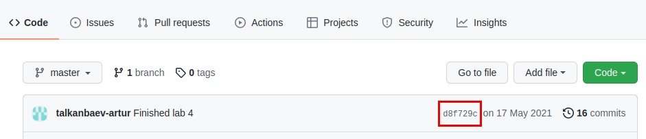
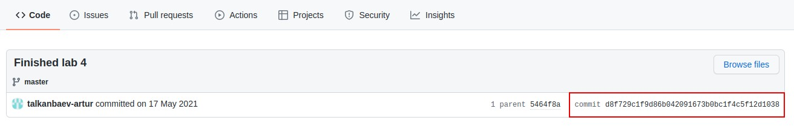
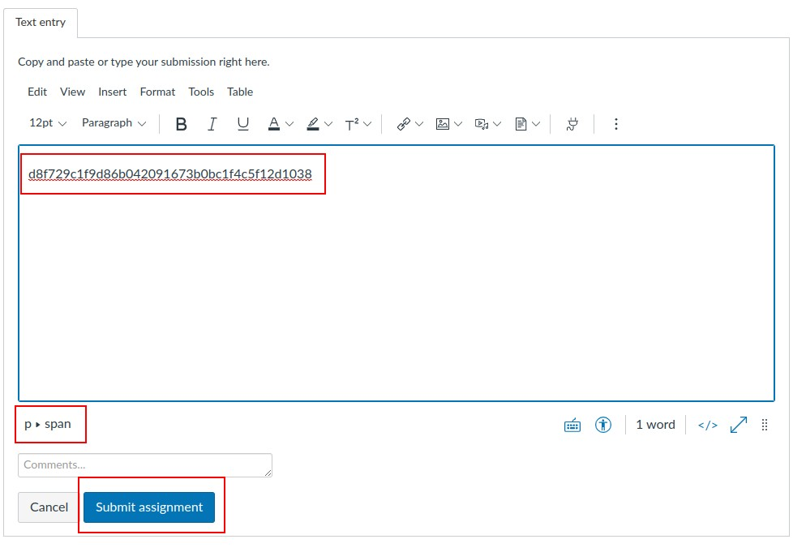

# How to do and submit your homework
### A short guide with tips on completing COM118-119 assignements

This guide is made to warn students of many common mistakes and formalize the submission format and checking process.

At the end of this file, after the complete set of rules and instruction, you can find a list of useful tips, which may help you to a

## Submitting assignments to Canvas Instructure

After you recive the assignment of Canvas Instructure *carefully* read the description, follow the instructions and associated links.
When you complete the assignment, according to the specification, follow these steps:

1. Open your **github classroom** repository

2. 
     
    
    Click on the shorthand id of your last commit

3. 
    
    
    Copy the full hash id of commit from the commit page withour any additional spaces or other information - just the long line of characters after the word `commit`

4. 
    
    
    Paste the hash in the submission field on Canvas
    If you done everything correctly you will see the `p > span` or `p` symbol at the bottom.

5. Make sure there are no additional line of text or empty spaces/tabs/newlines! Paste only 1 hash! Do not paste many hashes in the submission field.

6. Proceed by submitting the assignment.

7. You may update the hash unlimitied amount of times before the deadline. Just open your submission and replace the hash. You do not need to write the old/new hash to the comments - just update the submission field.

### How submission works

Canvas exports your submission as `html` file, and our scripts extract the hash id from these files. Then your hashes are used to get the correct version of your work. If you leave anything in the submission field, except the final id, the script may break and your submission will not be graded.

### How URI tasks are graded

We grade URI tasks by submitting your code to the Beecrowd in an automatic way. Please make sure that you have your tasks in the folder **with correct name**! If it would be named differently, the URI submission would not be graded. All grades on URI tasks are final, because they are calculated from Beecrowd results directly. Your accounts are not used, when checking the submission.

### How labs are graded

Labs are graded by an automated script with TA as a supervisor. It is important to have **exactly the same** output as described and shown in the Lab specification. ***Different output may result in getting 0 for specified task***.  

### About specification

The description of the task is comprehensive and all tasks are checked against it. Therefore, you *have to read the description carefully*. If description gives multiple variations of behaviour (2 or more different cases of input/output) your program has to support **all** of them, even if there is only one example of the input/output.

### Implementation details

Tasks, which tell you to implement code in a certain way, are code-checked manually. If task says that you need write code using special function or in a certain style - that means it is **required**. Your implementation would be checked. If you fail to follow the requirement, the task will be graded with 0.

### Formatting issues

This time policy regarding the output format of your lab tasks became harsher. Please follow the specified output format. Any cases of different outputs now will be considered as an error and will result in getting 0 for the specified problem. Note: tasks with undertmined output (random numbers, time related outputs, etc.) are not falling into this category. Differences in the time/random value are not considered.

### About cheating

All code tasks are checked against all students. This means that similar code samples would be detected automatically. Further audit would be done manually by TA. **Lowering case, changing variable/function/class names, order of variables/functions, or any other trick would not work**. The code checking id done in absolute way, as well as semantically, logically. 

## Tips to solve common issues

This section will be updated frequently to add more useful tips.

### Git

1. Merge error (without merge conflicts)
    
    If you worked on multiple machines and have created and pushed commits on them, without fetching changes, you may encounter merge error. 
    
    **Solution**: IntelliJ IDEA would suggest you to perform merge - do this, usually it is safe, when working on small codebases.

    **How to prevent**: to prevent the merge error update your repository as frequently as possible. You can use [this tutorial](https://www.jetbrains.com/idea/guide/tutorials/creating-a-project-from-github/git-fetch/) to discover how to fetch updates.

2. Merge error (with conflicts)

    If you changed the single file with two separate commits and forgot to fetch changes, you will encounter the merge conflict.

    **Soultion**: sometimes resolving conflicts is hard, and it can not be done automatically. You can revert your changes and delete the commit, update repository and redo the work. If you want to resolve conflicts anyway follow [this](https://www.jetbrains.com/idea/guide/tips/resolve-merge-conflicts/) and [this](https://www.jetbrains.com/help/idea/resolve-conflicts.html) tutorial. This process can be hard and I recommend you to read about git conflicts [here](https://www.atlassian.com/git/tutorials/using-branches/merge-conflicts).

    **How to prevent**: update your repository with git fetch, if you work using multiple machines.

3. Cloning error in the IntelliJ (Authentication failed)

    If you use an old Github access token from last semester, you may encounter an authentication error

    **Solution**: remove an old token from IntelliJ. Then add repository with new project again using VCS option - when dialog for Github authentication will pop up, select the Personal Access Token authorization and generate a new token. This will give IntelliJ Access to the new repository.

### Java errors

1. Wrong class name

    If you created the file using non-standard method you will encounter this error due to difference of class and file names. In java class has to have the same name as the file.

    **Solution**: rename the class or file to the same name

### Common mistakes

1. Index out of range 

    Cause: probably you messed up with the array indexing - it has size of *n* and you use an element with index *n+1* or bigger. Or it can be a negative index. Debugging may show what is the value of the breaking index.

    **Solution**: think about the access constraints. This error usually happens when the index is dynamic, so you better to check if this dynamic index is in bounds of the array size. **Just add additional checks and constraints to the code which accesses the array**

2. Presentation error/Wrong answer on URI (newline related)

    You wrote code and it does not pass. Try this first.

    Issue: the printing statements are either `print` or `printf` without the `%n` in the end. The new line is a big thing in the text formatting, and its absence is usually is considered as a mistake.

    **Solution**: watch carefully for `%n` newline symbols in your code, if you use `printf` and try to minimise the usage of `print`