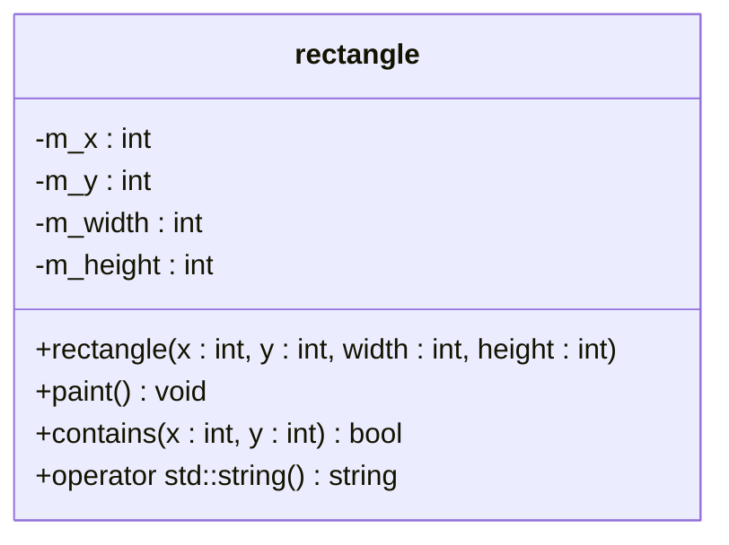
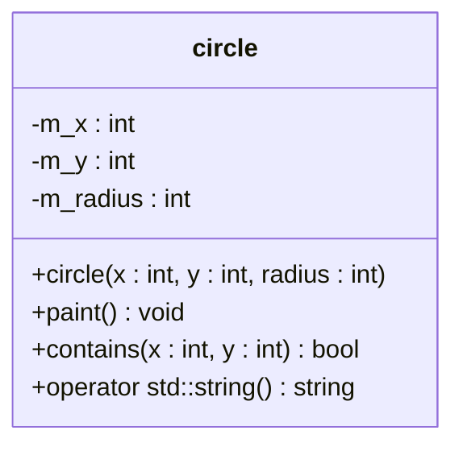
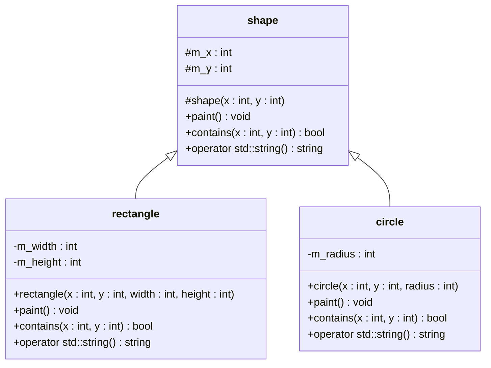
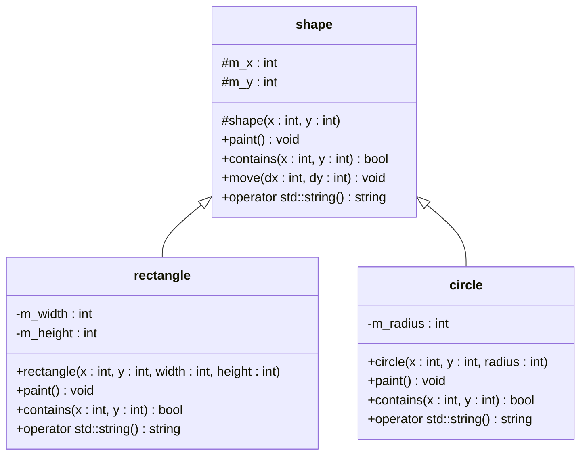

Object-oriented Programming, Practice #6
========================================

## Developer Tools

* [CLion](https://www.jetbrains.com/clion/download)
* [Git SCM](https://git-scm.com/downloads)

## Libraries

* [Qt 6](https://www.qt.io)

### Installing Qt 6

In this lab, you will be building simple GUI applications using the popular library Qt (pronounced "cute"). First, you will need to install the library on your system. Our labs already have the library installed. On your personal computer, you must follow the instructions below to install the library for your operating system. It is advisable to install the library as soon as possible and to contact your instructors in case of any problems. Failure to complete the library setup in time could hinder your ability to complete and submit the practical tasks by their deadlines. Please be aware that no extensions will be granted, and failing to set up the library will result in a zero for all online and offline assessments.

#### Windows

1. Download the following [archive](https://drive.google.com/file/d/14iCNNsdpZTj4t9ZNz4Mdi79Hd6pWwuab/view) and extract it to the `C:` drive. Ensure that after extraction there is a directory named `Qt` (`C:\Qt`), and inside it, a directory named `6.8.2` (`C:\Qt\6.8.2`). If you do not trust our package, you can install Qt 6 yourself using the official online [installer](https://www.qt.io/download-open-source). Select only the library for the MSVC compiler, version `6.8.2`; do not install any additional components, as the full installation requires significant disk space.
2. Run PowerShell as an administrator. Once open, execute the code below to set global OS variables that will help build tools locate your Qt 6 installation:

```powershell
[System.Environment]::SetEnvironmentVariable("Qt6_DIR", "C:\Qt\6.8.2\msvc2022_64", "Machine")

$currentPath = [System.Environment]::GetEnvironmentVariable("Path", "Machine")
$newDir = "C:\Qt\6.8.2\msvc2022_64\bin"
if ($currentPath -notlike "*$newDir*") {
    $updatedPath = "$currentPath;$newDir"
    [System.Environment]::SetEnvironmentVariable("Path", $updatedPath, "Machine")
}
```

#### macOS

1. Install or update the [Homebrew](https://brew.sh) package manager.
2. Install Qt 6 with Homebrew by running `brew install qt6` in the Terminal application.

#### Ubuntu

1. Install Qt 6 with the system package manager by running `sudo apt install qt6-base-dev` in the Terminal application.

---

## Important Notes

The checkpoints will be graded based on the visual output of your GUI programs, the correctness of your repository’s structure, and the style of your code. Ensure that your code style is consistent: your code should be properly indented, groups of code should be separated by blank lines, and variable names should follow a consistent naming convention while concisely describing the data they represent. Your files and directories must be named according to the requirements outlined at the bottom of the page. Moreover, your repository should not contain additional files with unrelated code, especially within the folder designated for lab tasks. If you are instructed to use a particular function, you must base your solution on that function, even if a better solution exists without it. Do not hesitate to contact your practice instructor if you have any questions.

---

## Problem #1: Prototype of a Graphics Editor, Version 0.1

Create a console application to prototype [model classes](https://en.wikipedia.org/wiki/Model–view–controller) of a simple vector graphics editor. In this prototype, a user can provide coordinates on a virtual canvas to select one of several test rectangles that you have created, and display its properties.

For this prototype, you need to design a class to represent a rectangle parametrically. Follow the [UML](https://www.visual-paradigm.com/guide/uml-unified-modeling-language/what-is-uml) class diagram below to implement your class:



Create an `std::vector` of `rectangle` instances with the following data:

```json
[
   { "x": 0,   "y": 0,    "width": 100, "height": 100 },
   { "x": 200, "y": 0,    "width": 50,  "height": 60  },
   { "x": 0,   "y": -200, "width": 100, "height": 30  },
   { "x": 0,   "y": 0,    "width": 130, "height": 100 }
]
```

In a loop, continue until an [EOF](https://en.wikipedia.org/wiki/End-of-file) condition is triggered by the user, prompt the user to enter the `x` and `y` coordinates of a point on the canvas. Test and print any `rectangle` instance from the `vector` that contains the point.

### Sample Input and Output

```
Shapes on the canvas:
{ "name": "rectangle", "x": 0, "y": 0, "width": 100, "height": 100 }
{ "name": "rectangle", "x": 200, "y": 0, "width": 50, "height": 60 }
{ "name": "rectangle", "x": 0, "y": -200, "width": 100, "height": 30 }
{ "name": "rectangle", "x": 0, "y": 0, "width": 130, "height": 100 }
Enter the 'x' coordinate: 0
Enter the 'y' coordinate: 0
The shape { "name": "rectangle", "x": 0, "y": 0, "width": 100, "height": 100 } was found at coordinates { "x": 0, "y": 0 }.
The shape { "name": "rectangle", "x": 0, "y": 0, "width": 130, "height": 100 } was found at coordinates { "x": 0, "y": 0 }.
Enter the 'x' coordinate: 200
Enter the 'y' coordinate: 30
The shape { "name": "rectangle", "x": 200, "y": 0, "width": 50, "height": 60 } was found at coordinates { "x": 200, "y": 30 }.
Enter the 'x' coordinate: 99
Enter the 'y' coordinate: -171
The shape { "name": "rectangle", "x": 0, "y": -200, "width": 100, "height": 30 } was found at coordinates { "x": 99, "y": -171 }.
Enter the 'x' coordinate: 99
Enter the 'y' coordinate: -170
Nothing was found.
Enter the 'x' coordinate: ^D/Z/C

```

## Problem #2: Prototype of a Graphics Editor, Version 0.2

Copy the code from the previous program and modify it to support testing whether points are inside a circle. For this prototype, you need to design a class that parametrically represents a circle. Do NOT use inheritance yet. Follow the UML class diagram below to implement your class:



Create an `std::vector` of `circle` instances using the data below, in addition to the existing `std::vector` of `rectangle` instances:

```json
[
   { "x": 0,   "y": 0, "radius": 50 }, 
   { "x": 200, "y": 0, "radius": 50 }
]
```

### Sample Input and Output

```
Shapes on the canvas:
{ "name": "rectangle", "x": 0, "y": 0, "width": 100, "height": 100 }
{ "name": "rectangle", "x": 200, "y": 0, "width": 50, "height": 60 }
{ "name": "rectangle", "x": 0, "y": -200, "width": 100, "height": 30 }
{ "name": "rectangle", "x": 0, "y": 0, "width": 130, "height": 100 }
{ "name": "circle", "x": 0, "y": 0, "radius": 50 }
{ "name": "circle", "x": 200, "y": 0, "radius": 50 }
Enter the 'x' coordinate: 0
Enter the 'y' coordinate: 0
The shape { "name": "rectangle", "x": 0, "y": 0, "width": 100, "height": 100 } was found at coordinates { "x": 0, "y": 0 }.
The shape { "name": "rectangle", "x": 0, "y": 0, "width": 130, "height": 100 } was found at coordinates { "x": 0, "y": 0 }.
The shape { "name": "circle", "x": 0, "y": 0, "radius": 50 } was found at coordinates { "x": 0, "y": 0 }.
Enter the 'x' coordinate: 200
Enter the 'y' coordinate: 30
The shape { "name": "rectangle", "x": 200, "y": 0, "width": 50, "height": 60 } was found at coordinates { "x": 200, "y": 30 }.
The shape { "name": "circle", "x": 200, "y": 0, "radius": 50 } was found at coordinates { "x": 200, "y": 30 }.
Enter the 'x' coordinate: 99
Enter the 'y' coordinate: -171
The shape { "name": "rectangle", "x": 0, "y": -200, "width": 100, "height": 30 } was found at coordinates { "x": 99, "y": -171 }.
Enter the 'x' coordinate: 99
Enter the 'y' coordinate: -170
Nothing was found.
Enter the 'x' coordinate: ^D/Z/C

```

## Problem #3: Prototype of a Graphics Editor, Version 0.3

Copy the code from the previous program and modify it to store both `rectangle` and `circle` instances in a single `std::vector` collection. Do this by introducing a base `shape` class from which the derived classes `rectangle` and `circle` inherit common data. You will need to use pointers to avoid [object slicing](https://en.wikipedia.org/wiki/Object_slicing); try using [smart pointers](https://en.cppreference.com/w/cpp/memory/unique_ptr) instead of raw pointers. Ensure that the derived classes implement the `paint` and `contains` member functions, and provide a conversion operator to `std::string`. To effectively use the conversion operator to `std::string` in an inheritance hierarchy, you may need to introduce additional private helper functions (for example, a `to_string` method) that the base class’s conversion operator can call. Remove any unnecessary code from the `main` function. Follow the [DRY](https://en.wikipedia.org/wiki/Don%27t_repeat_yourself) principle.



### Sample Input and Output

```
Shapes on the canvas:
{ "name": "rectangle", "x": 0, "y": 0, "width": 100, "height": 100 }
{ "name": "rectangle", "x": 200, "y": 0, "width": 50, "height": 60 }
{ "name": "rectangle", "x": 0, "y": -200, "width": 100, "height": 30 }
{ "name": "rectangle", "x": 0, "y": 0, "width": 130, "height": 100 }
{ "name": "circle", "x": 0, "y": 0, "radius": 50 }
{ "name": "circle", "x": 200, "y": 0, "radius": 50 }
Enter the 'x' coordinate: 0
Enter the 'y' coordinate: 0
The shape { "name": "rectangle", "x": 0, "y": 0, "width": 100, "height": 100 } was found at coordinates { "x": 0, "y": 0 }.
The shape { "name": "rectangle", "x": 0, "y": 0, "width": 130, "height": 100 } was found at coordinates { "x": 0, "y": 0 }.
The shape { "name": "circle", "x": 0, "y": 0, "radius": 50 } was found at coordinates { "x": 0, "y": 0 }.
Enter the 'x' coordinate: 200
Enter the 'y' coordinate: 30
The shape { "name": "rectangle", "x": 200, "y": 0, "width": 50, "height": 60 } was found at coordinates { "x": 200, "y": 30 }.
The shape { "name": "circle", "x": 200, "y": 0, "radius": 50 } was found at coordinates { "x": 200, "y": 30 }.
Enter the 'x' coordinate: 99
Enter the 'y' coordinate: -171
The shape { "name": "rectangle", "x": 0, "y": -200, "width": 100, "height": 30 } was found at coordinates { "x": 99, "y": -171 }.
Enter the 'x' coordinate: 99
Enter the 'y' coordinate: -170
Nothing was found.
Enter the 'x' coordinate: ^D/Z/C

```

## Problem #4: Prototype of a Graphics Editor, Version 0.4

Copy the code from the previous program, and then modify the main loop to allow commands such as 'paint', 'click', 'move', and 'exit' for user interaction. The code that prints the `std::vector` of shapes should execute only when the 'paint' command is issued by the user. Similarly, the logic to select a shape at a given point should trigger when the 'click' command is issued. The 'move' command should prompt the user to specify the `x` and `y` coordinates of the shape to be moved, as well as the `dx` and `dy` values by which to move the shape. If multiple shapes are located under the specified coordinates, only the one closest to the end of the `std::vector` should be selected for movement. To support shape movement, add a `move` member function to the `shape` class (as shown in the UML diagram below). Do not override the `move` function in child classes.



### Sample Input and Output

```
Enter the command ('paint', 'click', 'move', 'exit'): paint
{ "name": "rectangle", "x": 0, "y": 0, "width": 100, "height": 100 }
{ "name": "rectangle", "x": 200, "y": 0, "width": 50, "height": 60 }
{ "name": "rectangle", "x": 0, "y": -200, "width": 100, "height": 30 }
{ "name": "rectangle", "x": 0, "y": 0, "width": 130, "height": 100 }
{ "name": "circle", "x": 0, "y": 0, "radius": 50 }
{ "name": "circle", "x": 200, "y": 0, "radius": 50 }
Enter the command ('paint', 'click', 'move', 'exit'): click
Enter the 'x' coordinate: 200
Enter the 'y' coordinate: 30
The shape { "name": "rectangle", "x": 200, "y": 0, "width": 50, "height": 60 } was found at coordinates { "x": 200, "y": 30 }.
The shape { "name": "circle", "x": 200, "y": 0, "radius": 50 } was found at coordinates { "x": 200, "y": 30 }.
Enter the command ('paint', 'click', 'move', 'exit'): click
Enter the 'x' coordinate: 99
Enter the 'y' coordinate: -170
Nothing was found.
Enter the command ('paint', 'click', 'move', 'exit'): move
Enter the 'x' coordinate: 200
Enter the 'y' coordinate: 30
Enter the 'dx' shift: 10
Enter the 'dy' shift: -5
The shape { "name": "circle", "x": 200, "y": 0, "radius": 50 } at coordinates { "x": 200, "y": 30 } will be moved by { "dx": 10, "dy": -5 } and become { "name": "circle", "x": 210, "y": -5, "radius": 50 }.
Enter the command ('paint', 'click', 'move', 'exit'): move
Enter the 'x' coordinate: 99
Enter the 'y' coordinate: -170
Enter the 'dx' shift: 10
Enter the 'dy' shift: 20
Nothing was moved.
Enter the command ('paint', 'click', 'move', 'exit'): exit

```

## Problem #5: Prototype of a Graphics Editor, Version 0.5


Utilize the model classes created in previous programs to develop a graphics editor prototype using the Qt 6 library. This editor should allow users to draw rectangles and circles of a fixed size and color (selected by you) with a left mouse click on the virtual canvas. Right-clicking should select a shape, highlighting it with a distinguishable border. Users should be able to move the selected shape around the canvas by holding the right mouse button and moving the cursor. Pressing the `Delete` key (`Qt::Key_Delete`) should delete the currently selected shape. The program window MUST have the title 'Problem #5' and MUST be 500 by 500 pixels in size. Ensure that your program generates a screenshot similar to the one demonstrated below for the inputs in the grader.


If you are wondering what happened to version 1.0 of the program, note that in some academic semesters, students were required to build version 1.0 as a second project. This is not the case for this semester.

---

## Homework

Read Introduction to C++ Programming, 3rd Edition by Y. Daniel Liang, Chapter 9, 10, 11, 12, 14, 15, 16

---

## Expected Repository Structure

Upon completion of all assignments, your repository should look like this:

```
. (.idea, .gitignore, CMakeLists.txt, Readme.md)
├── problem01.cpp
├── problem02.cpp
├── problem03.cpp
├── problem04.cpp
└── problem05.cpp
```

If the files with assignments are named incorrectly, you will be penalized.

---

## Documentation

### C++

* `class`: <https://en.cppreference.com/w/cpp/language/class>
* `constructor`: <https://en.cppreference.com/w/cpp/language/constructor>
* `this`: <https://en.cppreference.com/w/cpp/language/this>
* `access-specifier`: <https://en.cppreference.com/w/cpp/language/access>
* `static`: <https://en.cppreference.com/w/cpp/language/static>
* `throw`: <https://en.cppreference.com/w/cpp/language/throw>
* `try-block`: <https://en.cppreference.com/w/cpp/language/try>
* `stdexcept`: <https://en.cppreference.com/w/cpp/header/stdexcept>
* `operator overloading`: <https://en.cppreference.com/w/cpp/language/operators>
* `friend`: <https://en.cppreference.com/w/cpp/language/friend>
* `std::stack`: <https://en.cppreference.com/w/cpp/container/stack>
* `std::vector`: <https://en.cppreference.com/w/cpp/container/vector>
* `destructors`: <https://en.cppreference.com/w/cpp/language/destructor>
* `copy constructor`: <https://en.cppreference.com/w/cpp/language/copy_constructor>
* `move constructor`: <https://en.cppreference.com/w/cpp/language/move_constructor>
* `copy assignment operator`: <https://en.cppreference.com/w/cpp/language/copy_assignment>
* `move assignment operator`: <https://en.cppreference.com/w/cpp/language/move_assignment>
* `rule of three/five/zero`: <https://en.cppreference.com/w/cpp/language/rule_of_three>
* `template`: <https://en.cppreference.com/w/cpp/language/templates>
* `derived classes`: <https://en.cppreference.com/w/cpp/language/derived_class>
* `lambda expressions`: <https://en.cppreference.com/w/cpp/language/lambda>

### Qt

* `Qt 6`: <https://doc.qt.io/qt.html>
