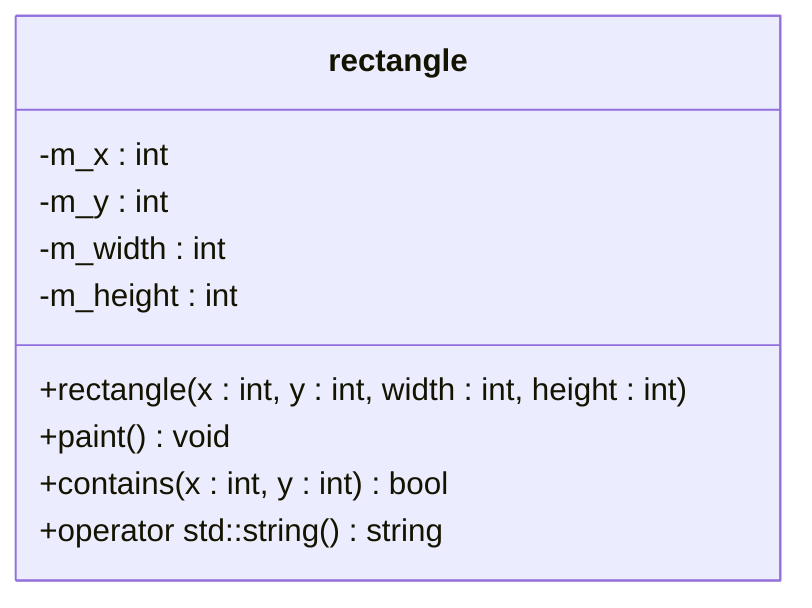
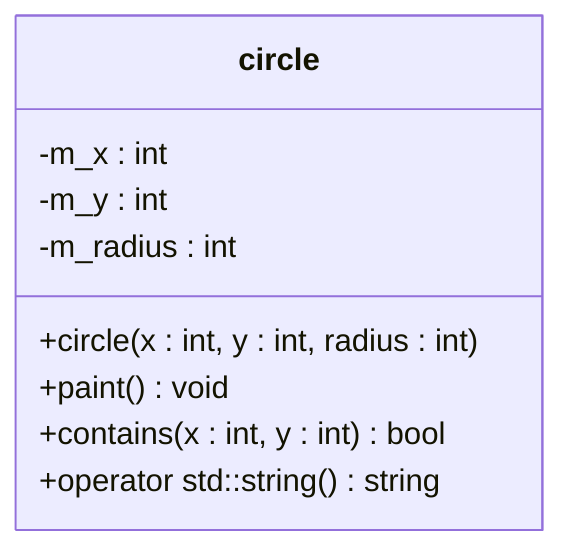
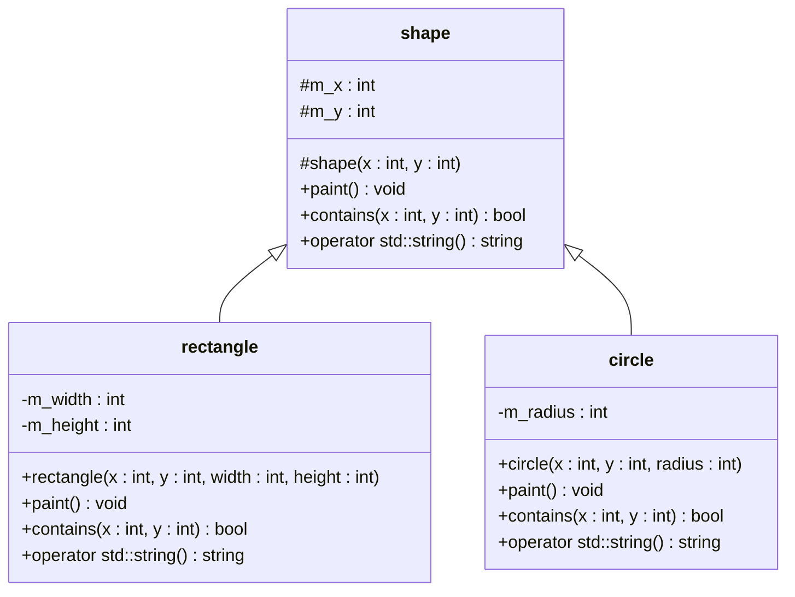
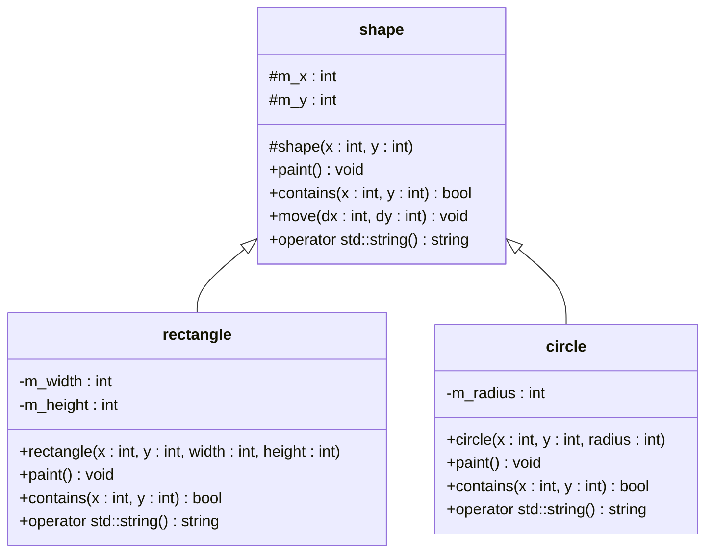

Object-oriented Programming, Practice #6
========================================

## Developer Tools

* [Git](https://git-scm.com)
* [CMake](https://cmake.org)
* [Python](https://www.python.org)
* [Conan](https://conan.io)
* [CLion](https://www.jetbrains.com/clion)

## Libraries

* [Qt 6](https://www.qt.io/product/qt6)

### Compiling and Installing Qt 6

Please follow the instructor's [directives](https://www.youtube.com/watch?v=WNS7AMa4JII) to install Qt 6 on your system. Note that the installation involves several steps and may require a significant amount of time. It is advisable to start this process as soon as possible and also contact your instructors as soon as possible in case of problems. Failure to complete the library setup in time could hinder your ability to complete and submit the practical tasks by their deadlines. Please be aware that no extensions will be granted, and failing to set up the library will result in a zero for all online and offline assessments.

0. Ensure you have installed all the necessary software mentioned in the video available [here](https://www.youtube.com/watch?v=WNS7AMa4JII).

1. Ensure the Conan package manager has at least the default compiler profile:

   ```
   conan profile detect --force
   ```

   If the generated profile has the C++ 14 standard selected, [edit](https://youtu.be/WNS7AMa4JII?t=3649) the profile file to change it to C++ 17.

2. Install dependencies using Conan for the `Debug` configuration:

    ```bash
    conan install . --build missing --settings build_type=Debug
    ```

    On Ubuntu, additional system packages might be required. Follow the recommendations in the output from the previous command or rerun Conan with the following options to install the necessary packages automatically:

    ```bash
    sudo apt install pkg-config
    conan install . --build missing --conf tools.system.package_manager:mode=install --conf tools.system.package_manager:sudo=True --settings build_type=Debug
    ```

3. Generate build files:

    ```bash
    # On Windows
    cmake --preset conan-default

    # On macOS, GNU/Linux, or Windows with WSL
    cmake --preset conan-debug
    ```

4. Build the project:

    ```bash
    cmake --build --preset conan-debug
    ```

## Important Notes

The checkpoints will be graded based on the text and visual output of your programs, the correctness of the structure of your repository, and the style of your code. Ensure that your code style is consistent, meaning the code is properly indented, groups of code are separated by blank lines, variable names are consistent in naming style, and describe in a compact manner the data stored in them. Your files and directories must be properly named as per the requirements outlined at the bottom of the page. Moreover, your repository should not contain additional files with unrelated code, especially within the folder designated for lab tasks. If you are told to use a particular function, you must base your solution on that function even if there exists a better solution without the use of it. Do not hesitate to contact your practice instructor if you have any questions.

## Problem #1: Prototype of a Graphics Editor, Version 0.1

Create a console application to prototype important parts of a vector graphics editor that you will further develop in Project 2. In this prototype, a user can provide coordinates on a virtual canvas to select one of several test rectangles that you have created, and display its properties.

For this prototype, you need to design a class to represent a rectangle parametrically. Follow the [UML](https://www.visual-paradigm.com/guide/uml-unified-modeling-language/what-is-uml) class diagram below to implement your class:



Create an `std::vector` of `rectangle` instances with the following data:

```json
[
   { "x": 0,   "y": 0,    "width": 100, "height": 100 },
   { "x": 200, "y": 0,    "width": 50,  "height": 60  },
   { "x": 0,   "y": -200, "width": 100, "height": 30  },
   { "x": 0,   "y": 0,    "width": 130, "height": 100 }
]
```

In a loop, continue until an [EOF](https://en.wikipedia.org/wiki/End-of-file) condition is triggered by the user, prompt the user to enter the `x` and `y` coordinates of a point on the canvas. Test and print any `rectangle` instance from the `vector` that contains the point.

### Sample Input and Output

```
Shapes on the canvas:
{ "name": "rectangle", "x": 0, "y": 0, "width": 100, "height": 100 }
{ "name": "rectangle", "x": 200, "y": 0, "width": 50, "height": 60 }
{ "name": "rectangle", "x": 0, "y": -200, "width": 100, "height": 30 }
{ "name": "rectangle", "x": 0, "y": 0, "width": 130, "height": 100 }
Enter the 'x' coordinate: 0
Enter the 'y' coordinate: 0
The shape { "name": "rectangle", "x": 0, "y": 0, "width": 100, "height": 100 } was found at coordinates { "x": 0, "y": 0 }.
The shape { "name": "rectangle", "x": 0, "y": 0, "width": 130, "height": 100 } was found at coordinates { "x": 0, "y": 0 }.
Enter the 'x' coordinate: 200
Enter the 'y' coordinate: 30
The shape { "name": "rectangle", "x": 200, "y": 0, "width": 50, "height": 60 } was found at coordinates { "x": 200, "y": 30 }.
Enter the 'x' coordinate: 99
Enter the 'y' coordinate: -171
The shape { "name": "rectangle", "x": 0, "y": -200, "width": 100, "height": 30 } was found at coordinates { "x": 99, "y": -171 }.
Enter the 'x' coordinate: 99
Enter the 'y' coordinate: -170
Nothing was found.
Enter the 'x' coordinate: ^D/Z/C

```

## Problem #2: Prototype of a Graphics Editor, Version 0.2

Copy the code from the previous program and modify it to support testing whether points are inside a circle. For this prototype, you need to design a class that parametrically represents a circle. Do NOT use inheritance yet. Follow the UML class diagram below to implement your class:



Create an `std::vector` of `circle` instances using the data below, in addition to the existing `std::vector` of `rectangle` instances:

```json
[
   { "x": 0,   "y": 0, "radius": 50 }, 
   { "x": 200, "y": 0, "radius": 50 }
]
```

### Sample Input and Output

```
Shapes on the canvas:
{ "name": "rectangle", "x": 0, "y": 0, "width": 100, "height": 100 }
{ "name": "rectangle", "x": 200, "y": 0, "width": 50, "height": 60 }
{ "name": "rectangle", "x": 0, "y": -200, "width": 100, "height": 30 }
{ "name": "rectangle", "x": 0, "y": 0, "width": 130, "height": 100 }
{ "name": "circle", "x": 0, "y": 0, "radius": 50 }
{ "name": "circle", "x": 200, "y": 0, "radius": 50 }
Enter the 'x' coordinate: 0
Enter the 'y' coordinate: 0
The shape { "name": "rectangle", "x": 0, "y": 0, "width": 100, "height": 100 } was found at coordinates { "x": 0, "y": 0 }.
The shape { "name": "rectangle", "x": 0, "y": 0, "width": 130, "height": 100 } was found at coordinates { "x": 0, "y": 0 }.
The shape { "name": "circle", "x": 0, "y": 0, "radius": 50 } was found at coordinates { "x": 0, "y": 0 }.
Enter the 'x' coordinate: 200
Enter the 'y' coordinate: 30
The shape { "name": "rectangle", "x": 200, "y": 0, "width": 50, "height": 60 } was found at coordinates { "x": 200, "y": 30 }.
The shape { "name": "circle", "x": 200, "y": 0, "radius": 50 } was found at coordinates { "x": 200, "y": 30 }.
Enter the 'x' coordinate: 99
Enter the 'y' coordinate: -171
The shape { "name": "rectangle", "x": 0, "y": -200, "width": 100, "height": 30 } was found at coordinates { "x": 99, "y": -171 }.
Enter the 'x' coordinate: 99
Enter the 'y' coordinate: -170
Nothing was found.
Enter the 'x' coordinate: ^D/Z/C

```

## Problem #3: Prototype of a Graphics Editor, Version 0.3

Copy the code from the previous program and modify it to store both `rectangle` and `circle` instances in a single `std::vector` collection. Achieve this by introducing a base `shape` class from which the child classes `rectangle` and `circle` will inherit common data. Enforce that child classes implement the `paint`, `contains`, and `operator std::string` methods. Remove unnecessary loops from the `main` function.



### Sample Input and Output

```
Shapes on the canvas:
{ "name": "rectangle", "x": 0, "y": 0, "width": 100, "height": 100 }
{ "name": "rectangle", "x": 200, "y": 0, "width": 50, "height": 60 }
{ "name": "rectangle", "x": 0, "y": -200, "width": 100, "height": 30 }
{ "name": "rectangle", "x": 0, "y": 0, "width": 130, "height": 100 }
{ "name": "circle", "x": 0, "y": 0, "radius": 50 }
{ "name": "circle", "x": 200, "y": 0, "radius": 50 }
Enter the 'x' coordinate: 0
Enter the 'y' coordinate: 0
The shape { "name": "rectangle", "x": 0, "y": 0, "width": 100, "height": 100 } was found at coordinates { "x": 0, "y": 0 }.
The shape { "name": "rectangle", "x": 0, "y": 0, "width": 130, "height": 100 } was found at coordinates { "x": 0, "y": 0 }.
The shape { "name": "circle", "x": 0, "y": 0, "radius": 50 } was found at coordinates { "x": 0, "y": 0 }.
Enter the 'x' coordinate: 200
Enter the 'y' coordinate: 30
The shape { "name": "rectangle", "x": 200, "y": 0, "width": 50, "height": 60 } was found at coordinates { "x": 200, "y": 30 }.
The shape { "name": "circle", "x": 200, "y": 0, "radius": 50 } was found at coordinates { "x": 200, "y": 30 }.
Enter the 'x' coordinate: 99
Enter the 'y' coordinate: -171
The shape { "name": "rectangle", "x": 0, "y": -200, "width": 100, "height": 30 } was found at coordinates { "x": 99, "y": -171 }.
Enter the 'x' coordinate: 99
Enter the 'y' coordinate: -170
Nothing was found.
Enter the 'x' coordinate: ^D/Z/C

```

## Problem #4: Prototype of a Graphics Editor, Version 0.4

Copy the code from the previous program and modify the main loop to allow commands such as 'paint', 'click', 'move', and 'exit' for user interaction. The code for printing the `std::vector` of shapes should only be executed when the 'paint' command is issued by the user. Similarly, the logic to select a shape at a given point should now occur upon the issuance of the 'click' command. The 'move' command should prompt the user to specify the `x` and `y` coordinates of the shape to move and the `dx` and `dy` values by which to move the shape. If multiple shapes are located under the `x` and `y` coordinates, only the one closest to the end of the `std::vector` should be selected for movement. To support shape movement, add a `move` member function to the `shape` class (as shown in the UML diagram below). Do not override the `move` function in child classes.



### Sample Input and Output

```
Enter the command ('paint', 'click', 'move', 'exit'): paint
{ "name": "rectangle", "x": 0, "y": 0, "width": 100, "height": 100 }
{ "name": "rectangle", "x": 200, "y": 0, "width": 50, "height": 60 }
{ "name": "rectangle", "x": 0, "y": -200, "width": 100, "height": 30 }
{ "name": "rectangle", "x": 0, "y": 0, "width": 130, "height": 100 }
{ "name": "circle", "x": 0, "y": 0, "radius": 50 }
{ "name": "circle", "x": 200, "y": 0, "radius": 50 }
Enter the command ('paint', 'click', 'move', 'exit'): click
Enter the 'x' coordinate: 200
Enter the 'y' coordinate: 30
The shape { "name": "rectangle", "x": 200, "y": 0, "width": 50, "height": 60 } was found at coordinates { "x": 200, "y": 30 }.
The shape { "name": "circle", "x": 200, "y": 0, "radius": 50 } was found at coordinates { "x": 200, "y": 30 }.
Enter the command ('paint', 'click', 'move', 'exit'): click
Enter the 'x' coordinate: 99
Enter the 'y' coordinate: -170
Nothing was found.
Enter the command ('paint', 'click', 'move', 'exit'): move
Enter the 'x' coordinate: 200
Enter the 'y' coordinate: 30
Enter the 'dx' shift: 10
Enter the 'dy' shift: -5
The shape { "name": "circle", "x": 200, "y": 0, "radius": 50 } at coordinates { "x": 200, "y": 30 } will be moved by { "dx": 10, "dy": -5 } and become { "name": "circle", "x": 210, "y": -5, "radius": 50 }.
Enter the command ('paint', 'click', 'move', 'exit'): move
Enter the 'x' coordinate: 99
Enter the 'y' coordinate: -170
Enter the 'dx' shift: 10
Enter the 'dy' shift: 20
Nothing was moved.
Enter the command ('paint', 'click', 'move', 'exit'): exit

```

## Problem #5: Prototype of a Graphics Editor, Version 0.5


Utilize the model classes created in previous programs to develop a graphics editor prototype using the Qt 6 library. This editor should allow users to draw rectangles and circles of a fixed size and color (selected by you) with a left mouse click on the virtual canvas. Right-clicking should select a shape, highlighting it with a distinguishable border. Users should be able to move the selected shape around the canvas by holding the right mouse button and moving the cursor. Pressing the `Delete` key (`Qt::Key_Delete`) should delete the currently selected shape.

## Homework

Read Introduction to C++ Programming, 3rd Edition by Y. Daniel Liang, Chapter 9, 10, 11, 12, 14, 15, 16

## Expected Repository Structure

Upon completion of all assignments, your repository should look like this:

```
. (.idea, .gitignore, CMakeLists.txt, Readme.md)
├── data...
├── problem1.cpp
├── problem2.cpp
├── problem3.cpp
├── problem4.cpp
└── problem5.cpp
```

If the files with assignments are named incorrectly, you will be penalized.

## Documentation

### C++

* `class`: <https://en.cppreference.com/w/cpp/language/class>
* `constructor`: <https://en.cppreference.com/w/cpp/language/constructor>
* `this`: <https://en.cppreference.com/w/cpp/language/this>
* `access-specifier`: <https://en.cppreference.com/w/cpp/language/access>
* `static`: <https://en.cppreference.com/w/cpp/language/static>
* `throw`: <https://en.cppreference.com/w/cpp/language/throw>
* `try-block`: <https://en.cppreference.com/w/cpp/language/try_catch>
* `stdexcept`: <https://en.cppreference.com/w/cpp/header/stdexcept>
* `operator overloading`: <https://en.cppreference.com/w/cpp/language/operators>
* `friend`: <https://en.cppreference.com/w/cpp/language/friend>
* `std::stack`: <https://en.cppreference.com/w/cpp/container/stack>
* `std::vector`: <https://en.cppreference.com/w/cpp/container/vector>
* `destructors`: <https://en.cppreference.com/w/cpp/language/destructor>
* `copy constructor`: <https://en.cppreference.com/w/cpp/language/copy_constructor>
* `move constructor`: <https://en.cppreference.com/w/cpp/language/move_constructor>
* `copy assignment operator`: <https://en.cppreference.com/w/cpp/language/copy_assignment>
* `move assignment operator`: <https://en.cppreference.com/w/cpp/language/move_assignment>
* `rule of three/five/zero`: <https://en.cppreference.com/w/cpp/language/rule_of_three>
* `template`: <https://en.cppreference.com/w/cpp/language/templates>
* `derived classes`: <https://en.cppreference.com/w/cpp/language/derived_class>
* `lambda expressions`: <https://en.cppreference.com/w/cpp/language/lambda>

### Qt

* `Qt 6`: <https://doc.qt.io/qt.html>
